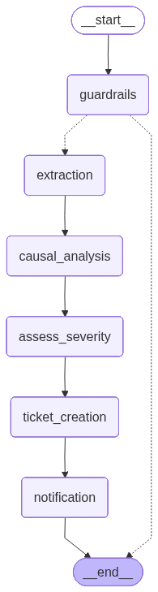

# Upstream
> A multimodal SRE intake and triage agent that doesn't trust the reporter.


Upstream is a multimodal SRE intake and triage agent for e-commerce incidents.
It accepts an incident report, a raw log file, and an optional screenshot,
then builds its own evidence-backed causal hypothesis instead of blindly
following the reporter's guess.
The system is intentionally skeptical.
It treats the reporter's diagnosis as a starting point to verify,
not as the command to execute.
That single product decision changes who gets paged,
which code paths get inspected,
and how quickly the real owner is identified.

Upstream is designed around a concrete demo target:
the `dotnet/eShop` reference application.
We index a curated subset of eShop source files into Qdrant,
use LangGraph to orchestrate analysis and handoffs,
and keep the entire workflow visible through self-hosted Langfuse traces.
The result is a project that reads like an incident tool,
but behaves like a careful SRE teammate who asks,
"What does the evidence actually support?"

**Status:** End-to-end demo implementation complete, including guardrails,
multi-provider LLM routing, structured observability, and evidence-backed docs.

**Quick links**

- Repository: <https://github.com/neo3x/upstream>
- Demo video: [Demo video on YouTube](#)
- Architecture diagram: [docs/evidence/architecture_diagram.png](docs/evidence/architecture_diagram.png)
- Agent write-up: [AGENTS_USE.md](AGENTS_USE.md)

## The Problem
### The first minute of an incident is expensive
The first minute of an incident decides the shape of the next hour.
If the wrong service gets blamed early,
the wrong team gets paged first.
If the wrong team gets paged first,
debugging starts in the wrong codebase.
If debugging starts in the wrong codebase,
every escalation after that becomes slower,
noisier,
and more political than technical.

Most incident tooling optimizes for intake speed.
That is useful,
but it does not solve the real problem when the intake itself is wrong.
In practice,
human incident reports are often incomplete,
emotionally charged,
and written from the perspective of symptoms rather than causes.
The person reporting the issue is usually closest to the pain,
not necessarily closest to the root cause.
### Reports are often symptom-first, not cause-first
A customer-facing failure in an e-commerce system rarely stays inside one service.
An auth outage can surface as checkout failures.
A message bus issue can look like an ordering issue.
A slow dependency can appear as a broken API when the API is only the place
where the timeout becomes visible.

That means a report like,
"Ordering is down,"
is often not a diagnosis.
It is a symptom statement wrapped in a diagnosis.
If responders take it literally,
they can lose valuable time searching the wrong service,
reviewing the wrong logs,
and opening the wrong ticket.
### E-commerce makes blame especially noisy
Modern e-commerce systems are interconnected by design.
Identity,
ordering,
payments,
catalog,
and event-driven components all influence the customer journey.
When one dependency fails,
another service is usually where the damage becomes visible.
The visible blast radius and the actual fault domain are not always the same.

That distinction matters operationally.
The wrong escalation path means:

1. The wrong team is interrupted.
2. The real team receives the signal later.
3. Investigators start from a misleading hypothesis.
4. Hand-offs multiply.
5. Mean time to confidence grows before mean time to resolution can shrink.
### The hidden cost is loss of confidence
Every avoidable escalation also reduces trust in the incident process.
Reporters feel unheard if their evidence is ignored.
Engineers feel frustrated if they are paged for symptoms they do not own.
Managers see duplicate effort rather than clear triage.
The outcome is not just slower debugging.
It is organizational drag at the exact moment calm judgment matters most.

Upstream is built to reduce that drag.
It does not replace human responders.
It improves the quality of the first structured hypothesis they receive.
## The Idea
Upstream's defining idea is simple:
the reporter is important,
but the reporter is not automatically right.
The system treats the stated diagnosis as a hypothesis to verify.
It cross-references the reported symptoms against the actual implementation
of a real e-commerce codebase,
matches those symptoms with log evidence,
and forms its own causal assessment before deciding which team should act.

That is why the product is named **Upstream**.
It pushes investigation earlier in the incident lifecycle,
closer to the point where assumptions can still be corrected.
Instead of forwarding blame,
it reconstructs responsibility from evidence.
### Evidence, not deference
Upstream is intentionally built around grounded analysis.
Every important claim in the agent's output should be tied to one of four sources:

1. The reporter's text description.
2. The uploaded log file.
3. The optional screenshot.
4. Retrieved code context from the indexed eShop snapshot.

The goal is not to generate a polished guess.
The goal is to generate a defensible assignment recommendation.
### Why use a real codebase
Many incident triage demos stop at summarization.
Upstream goes further by anchoring reasoning in the structure of a real,
multi-service application.
The indexed subset of `dotnet/eShop`
gives the agent technical context about service boundaries,
events,
identity flows,
and expected interactions between components.

That matters because "who owns the fix"
is a code question as much as it is a logging question.
If the agent can retrieve the relevant service boundaries,
handlers,
and integration points,
it has a better chance of disagreeing with the initial accusation correctly.
### Multimodal by design
Upstream is not text-only.
It is designed for the way incidents actually get reported:

- A short free-form description from the reporter.
- A pasted or uploaded log file.
- An optional screenshot of an error page,
  dashboard,
  or monitoring panel.

The multimodal input is not decorative.
It allows the extraction step to combine human language,
machine output,
and interface-level evidence into a single structured symptom record.
## What Upstream Does
Upstream's assignment flow follows five consistent steps.
These steps are simple enough to explain to a mentor evaluator,
but specific enough to show that the project has a concrete operational model.

1. **Reporter submits an incident.**
   The user provides a text description of what they believe is happening,
   attaches a log file,
   and can optionally include a screenshot.
   The input is intentionally close to real-world incident intake:
   messy,
   partial,
   and opinionated.

2. **The agent triages the evidence.**
   Upstream validates the payload,
   detects injection attempts,
   parses the logs,
   extracts structured symptoms,
   retrieves relevant eShop code context from Qdrant,
   and forms a causal hypothesis about the most likely owning service
   or infrastructure dependency.

3. **The agent creates a ticket in the mocked Jira system.**
   The ticket contains the reporter summary,
   the agent's structured findings,
   severity estimation,
   and the evidence that justified the assignment.
   The ticket is designed to be useful even if a human reviewer disagrees,
   because it preserves the reasoning trail.

4. **The agent notifies the responsible team.**
   The notified team may differ from the team named by the reporter.
   That is the core product behavior.
   Upstream is successful when it routes action to the team supported by evidence,
   not the team named first.

5. **Resolution closes the loop with the original reporter.**
   When the ticket is marked resolved in the mock Jira flow,
   a smaller resolution graph produces a short summary of what was actually fixed
   and notifies the original reporter through the notification mock.
### The output is more than a classification
Upstream does not only answer,
"Which team should receive this?"
It also answers:

- What symptoms were extracted?
- What evidence supports the assignment?
- What alternative hypothesis was considered?
- How severe is the issue likely to be?
- What did the reporter assume that the system disagreed with?

That richer output is what makes the tool useful in a real triage setting.
## Architecture Overview

_Auto-generated from the compiled LangGraph workflow and exported from the running agent._

At a high level,
Upstream is composed of one agent service,
one reporter-facing UI,
two integration mocks,
one vector store,
and one observability stack.
The UI collects incidents.
The agent service performs orchestration and analysis.
Qdrant stores indexed code embeddings from the curated eShop snapshot.
Langfuse captures traces and latency/cost signals for LLM interactions.
The Jira mock and notification mock make downstream hand-offs visible
without relying on proprietary external systems during the hackathon demo.

For the detailed system write-up,
see [docs/architecture.md](docs/architecture.md).
### Core services
| Component | Purpose | Notes |
| --- | --- | --- |
| `services/ui` | Reporter-facing intake UI | FastAPI + Jinja2 + HTMX + Tailwind |
| `services/agent` | Main orchestration and analysis service | FastAPI + LangGraph + provider adapters |
| `services/jira_mock` | Ticket system simulation | Receives triage output and stores ticket state |
| `services/notification_mock` | Notification inbox simulation | Shows downstream messages to teams and reporters |
| `indexer` | Code indexing utilities | Embeds curated eShop snapshot into Qdrant |
| `eshop_snapshot` | Curated reference code subset | Ordering, Identity, EventBus, and docs |
| `Qdrant` | Vector retrieval layer | Stores code chunks and embeddings |
| `Langfuse` | LLM observability | Traces, costs, latency, and agent flow visibility |
### Exposed ports
Only the interfaces needed for the demo are exposed:

- `3000` — Main reporter UI
- `3001` — Langfuse dashboard
- `3100` — Jira mock board
- `3200` — Notification mock inbox

All other service-to-service communication is intended to stay internal
to the Docker network.
That keeps the local demo surface small,
reduces accidental port conflicts,
and better reflects a production boundary mindset.
### High-level data flow
1. The reporter submits text,
   logs,
   and an optional screenshot through the UI.
2. The UI forwards the payload to the agent service.
3. Guardrails validate the request before LLM-heavy work begins.
4. The extraction node converts raw inputs into structured symptoms.
5. Retrieval pulls the most relevant eShop code chunks from Qdrant.
6. The causal analysis node forms a grounded hypothesis.
7. Severity estimation adds priority and likely blast radius.
8. Ticket creation writes to the Jira mock.
9. Notification dispatch writes to the notification mock.
10. Resolution webhooks trigger a smaller post-resolution summary flow.
### Why this layout fits the hackathon
This architecture is intentionally practical.
It is complex enough to demonstrate orchestration,
retrieval,
multimodal reasoning,
and observability.
It is also constrained enough to be explainable in a README,
deployable with Docker Compose,
and reviewable by mentors without requiring access to any proprietary systems.
## LLM Providers
Upstream supports three provider paths because incident response environments
have different constraints around privacy,
cost,
network access,
and reasoning quality.
Provider flexibility is not an accessory feature.
It is part of the project's Responsible AI story.
### Claude (recommended)
Claude Sonnet is the recommended default for Upstream.
It offers strong reasoning quality for cross-service causal analysis,
good multimodal support,
and reliable performance on long,
messy operational prompts where retrieval results,
log fragments,
and human descriptions need to be synthesized together.

Claude is the provider most aligned with the project's core promise:
challenging the reporter's diagnosis with careful,
evidence-based reasoning.
### OpenAI
OpenAI is supported as a cloud alternative for teams that prefer its API stack
or already standardize on it internally.
It offers similar deployment ergonomics for a hosted provider setup
and keeps the architecture provider-agnostic.

The goal is not to treat providers as interchangeable.
The goal is to let teams choose a hosted path that fits procurement,
compliance,
or platform preferences while keeping the same orchestration model.
### Ollama
Ollama is the privacy-first option.
It enables fully local execution for environments where sensitive logs
cannot leave an internal network or where internet access is constrained.
The trade-off is explicit:
data sovereignty improves,
but reasoning quality is expected to be lower than frontier cloud models,
especially for disagreement-heavy causal analysis and multimodal interpretation.

That trade-off is acceptable in some settings.
It is not hidden in the product narrative.
Responsible AI is partly about saying clearly when the safer or more private path
is not automatically the most accurate path.
### Provider comparison
| Provider | Best fit | Strengths | Trade-offs |
| --- | --- | --- | --- |
| Claude | Default cloud deployment | Strong reasoning, multimodal quality, good for contradictory evidence | Requires external API access |
| OpenAI | Hosted alternative | Familiar cloud tooling, strong general capability | Similar hosted-data trade-offs |
| Ollama | Local / air-gapped deployments | Full data sovereignty, offline-friendly | Lower reasoning quality, model download and GPU/CPU overhead |
### Provider selection philosophy
Upstream is opinionated about defaults,
not dogmatic about infrastructure.
The product recommends Claude because the core experience depends on the model
being able to say,
"the reporter is probably wrong,"
and justify that carefully.
At the same time,
the system keeps OpenAI and Ollama paths available so teams can choose the risk,
privacy,
and cost profile that fits their environment.
## Quick Start
The intended local setup is deliberately small:
clone the repo,
copy the environment file,
set one provider credential,
and run Docker Compose.

```bash
git clone https://github.com/neo3x/upstream.git
cd upstream
cp .env.example .env
# Edit .env with your API key
docker compose up --build
```

Once the stack is up,
open <http://localhost:3000>.

On Windows PowerShell,
the same startup flow is wrapped in:

```powershell
.\scripts\start_demo_stack.ps1
```

To enable the bundled Ollama container too:

```bash
docker compose --profile ollama up --build
```

For the shorter,
operator-oriented setup guide,
see [QUICKGUIDE.md](QUICKGUIDE.md).
### Expected local surfaces
After startup,
the main interfaces are:

- Reporter UI: <http://localhost:3000>
- Langfuse: <http://localhost:3001>
- Jira mock: <http://localhost:3100>
- Notification mock: <http://localhost:3200>
- Agent health: <http://localhost:8000/health>
### What happens on first build
The first build is expected to do more work than later runs.
It needs to assemble the service images,
prepare the self-hosted support services,
initialize Qdrant,
run the one-shot indexer job against the curated eShop snapshot,
and start the Langfuse stack.

That startup sequencing is intentional:
the agent waits for indexing to complete before it begins serving requests,
so retrieval is ready on first use.
## Demo Scenarios
The demo is organized around three scenarios.
Each one is chosen to show a different dimension of Upstream's behavior.

For the full walkthroughs,
see [docs/demo-scenarios.md](docs/demo-scenarios.md).
### 1. Identity cascade
The reporter blames Ordering because checkout symptoms appear there.
Upstream inspects the logs,
retrieves relevant code context,
and identifies Identity as the more likely upstream fault domain.

**One-line summary:**
visible failure in Ordering,
actual root cause in Identity.
### 2. Silent EventBus
The reporter again suspects Ordering,
but the more important signal is the absence of expected message-bus activity.
Upstream treats "nothing happened" in the EventBus path as evidence,
not as missing data,
and assigns the issue toward the messaging layer.

**One-line summary:**
absence of expected events points to RabbitMQ / EventBus,
not to Ordering business logic.
### 3. Prompt injection
A malicious reporter tries to manipulate the system with instructions embedded
in the payload.
Upstream detects the injection pattern during guardrails,
routes to a security-oriented handling path,
and prevents the main analysis LLM flow from executing unsafe instructions.

**One-line summary:**
unsafe prompt content is rejected before it can steer triage.
### Why these scenarios matter
Together,
the three scenarios demonstrate:

- disagreement with the reporter
- evidence-based reassignment
- log-aware causal reasoning
- multimodal intake
- security guardrails
- end-to-end handoff and closure

That combination is the core story of the project.
## Repository Structure
The repository is organized as a monorepo with service-specific folders
under `services/`.
That keeps the demo stack coherent,
makes Docker Compose orchestration straightforward,
and keeps implementation boundaries visible to readers.

```text
upstream/
├── README.md
├── AGENTS_USE.md
├── SCALING.md
├── QUICKGUIDE.md
├── LICENSE
├── .env.example
├── docker-compose.yml
├── docs/
├── services/
│   ├── agent/
│   ├── ui/
│   ├── jira_mock/
│   └── notification_mock/
├── indexer/
├── eshop_snapshot/
├── scripts/
└── phases/
```
### Top-level folders
| Path | Purpose |
| --- | --- |
| `docs/` | Supporting project documentation, architecture notes, and scenario write-ups |
| `services/agent/` | Main agent service, LangGraph nodes, prompts, tools, tests, and local checkpoints |
| `services/ui/` | Reporter-facing web interface |
| `services/jira_mock/` | Mock ticketing service used in demos |
| `services/notification_mock/` | Mock notification service used in demos |
| `indexer/` | Index build-time logic for the eShop snapshot |
| `eshop_snapshot/` | Curated subset of `dotnet/eShop` used as technical retrieval context |
| `scripts/` | Utility scripts for resets, setup, and operational helpers |
| `phases/` | Build plan and execution phase artifacts |
### Why the snapshot lives in-repo
The eShop snapshot is included as a curated subset of the MIT-licensed
`dotnet/eShop` reference application rather than fetched on demand because the
demo needs deterministic retrieval context.
That makes the hackathon setup easier to review,
reduces external setup surprises,
and ensures everyone sees the same service boundaries during triage.
## What's In This Repo
The repo is intentionally documentation-heavy because the evaluation context
is documentation-first.
Mentors may never run the stack,
so the docs need to communicate the system clearly on their own.

- [README.md](README.md) — project overview, repo map, quick start, and submission framing
- [AGENTS_USE.md](AGENTS_USE.md) — official AgentX-style agent write-up,
  orchestration details,
  use cases,
  guardrails,
  and lessons learned structure
- [SCALING.md](SCALING.md) — production scaling analysis,
  bottlenecks,
  cost assumptions,
  and hardening roadmap
- [QUICKGUIDE.md](QUICKGUIDE.md) — short setup guide for local operators
- [docs/architecture.md](docs/architecture.md) — detailed architecture notes and diagrams
- [docs/responsible-ai.md](docs/responsible-ai.md) — provider choices,
  privacy trade-offs,
  and guardrail philosophy
- [docs/demo-scenarios.md](docs/demo-scenarios.md) — full walkthroughs for the three demo paths
## Tech Stack
Upstream is intentionally built from familiar,
production-oriented pieces rather than exotic infrastructure.
That keeps the story grounded and makes the project easier to extend after the
hackathon.

| Layer | Technology | Version / note | Why it is used |
| --- | --- | --- | --- |
| Primary language | Python | 3.11+ | Good ecosystem for FastAPI, LangGraph, and service glue |
| API / service layer | FastAPI | Current stable 0.11x line planned | Clean async service boundaries and simple JSON handling |
| Orchestration | LangGraph | Current stable line planned | Explicit graph control, state passing, conditional routing |
| LLM provider | Claude Sonnet | Recommended default | Strong reasoning and multimodal handling |
| Alternate providers | OpenAI, Ollama | Configurable | Hosted alternative and local/private alternative |
| Vector store | Qdrant | Dockerized deployment | Semantic retrieval over indexed eShop code chunks |
| Observability | Langfuse | Self-hosted | Trace visibility, cost awareness, latency tracking |
| Structured logs | structlog | Python package | Correlation-friendly operational logging |
| UI rendering | Jinja2 + HTMX + Tailwind | Server-rendered UI stack | Fast iteration without frontend build complexity |
| Ticketing demo | Jira mock | Local service | Visible assignment workflow without external dependency |
| Notification demo | Notification mock | Local service | Visible closure and routing feedback |
| Container orchestration | Docker Compose | Required hackathon path | Single-command local stack startup |
### Why this stack fits the problem
The incident workflow is orchestration-heavy,
not frontend-heavy.
FastAPI and LangGraph let the team focus on control flow,
retrieval,
observability,
and error handling.
HTMX and server-rendered templates keep the UI lightweight and explainable.
Qdrant and Langfuse make the system's reasoning context and runtime behavior
inspectable rather than magical.
## Hackathon Submission
Upstream is built for the AgentX Hackathon.
It is structured to satisfy the submission expectations around public source,
clear documentation,
reproducible local setup,
and visible agent behavior.
### Submission checklist
- Public GitHub repository
- MIT license
- Docker Compose-based local startup path
- Mandatory documentation files at the repo root
- Demo video link
- Responsible AI explanation,
  including provider trade-offs and guardrail behavior
### Demo video
[Demo video on YouTube]( <https://youtu.be/TDbzcFA7LpY>)

`#AgentXHackathon`
### What evaluators should understand from this repo
An evaluator should be able to answer the following after reading the docs:

1. What Upstream is.
2. Why incident reports are often wrong.
3. How the agent uses code retrieval to challenge the reporter.
4. What the three demo scenarios prove.
5. Why provider choice and guardrails are part of the design,
   not afterthoughts.
## License
MIT — see [LICENSE](LICENSE)
## Acknowledgments
Upstream builds on the generosity of open tools and reference projects.

- Thanks to **dotnet/eShop** for providing a realistic e-commerce codebase
  whose service boundaries make this triage problem concrete.
- Thanks to **LangChain / LangGraph** for the orchestration primitives that make
  graph-based agent workflows practical.
- Thanks to **Langfuse** for making LLM traces inspectable,
  which is especially important in a project that needs to justify its reasoning.
- Thanks to **Qdrant** for the retrieval layer that grounds causal analysis in
  actual code context.
- Thanks to **Anthropic** for the primary frontier-model path used in the
  default configuration.

This project is built from scratch for AgentX Hackathon as required by the
submission rules.
