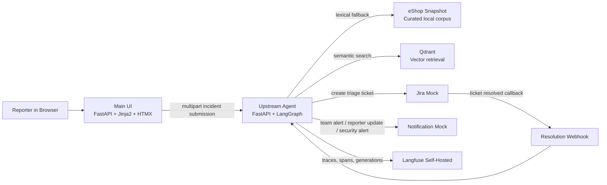
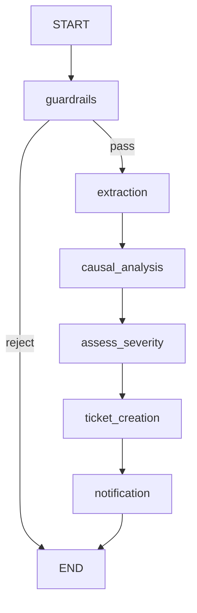
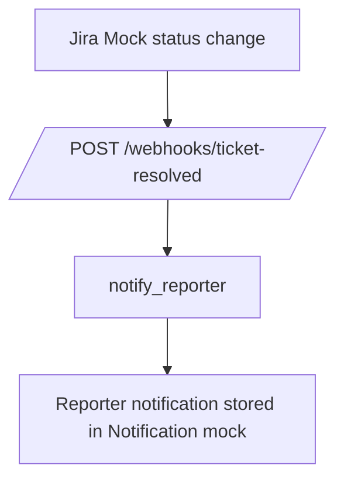

# Upstream Architecture

## Overview

Upstream is a small multi-service system for SRE incident intake and first-pass
triage.
It is deliberately split into visible components so a reviewer can follow the
full operational path:

1. a reporter submits an incident
2. the agent validates and analyzes it
3. a ticket is created for the likely owning team
4. notifications are sent
5. the resolution webhook closes the loop with the original reporter

The core product behavior lives in the agent service:
it can disagree with the reporter's diagnosis,
ground that disagreement in logs plus code context,
and route the incident to a more plausible owner.

_Auto-generated from the compiled LangGraph workflow and exported from the
running agent container._

## Full-System Diagram

## Runtime Components

### `services/ui`

The UI is the reporter-facing entry point.
It collects the incident description,
required log upload,
optional screenshot,
and LLM provider selection.
It forwards the submission to the agent over HTTP and renders either:

- a successful triage result with hypothesis and ticket link, or
- a guardrail rejection card

The UI is intentionally server-rendered and lightweight so it is easy to demo,
debug, and run in Docker without a Node build pipeline.

### `services/agent`

The agent service owns the business logic:

- LangGraph orchestration
- LLM provider abstraction
- prompt templates
- code retrieval against the curated eShop corpus
- guardrails
- structured logging and tracing
- ticket and notification integrations

This is the only service that reasons about incidents.

### `services/jira_mock`

The Jira mock stores tickets created by the agent and exposes a board-like UI.
It also emits the resolution webhook when a ticket is moved to `resolved`,
which lets Upstream demonstrate the end-to-end closed loop.

### `services/notification_mock`

The notification mock stores outbound notifications and renders them in a simple
inbox-style UI.
It is used for:

- team alerts
- reporter updates after resolution
- security alerts generated by guardrails

### Qdrant and the eShop snapshot

The retrieval corpus is a curated subset of the MIT-licensed `dotnet/eShop`
reference application stored directly in this repository.
Upstream queries Qdrant when the collection is available and falls back to
lexical search over the same local snapshot when vector infrastructure is not
available.

That fallback is important for demo resilience:
retrieval still works even if Qdrant is unavailable.

### Langfuse

Langfuse is integrated as an optional observability layer.
It is not coupled to the business logic.
When configured,
it captures traces,
node spans,
LLM generations,
latency,
and token usage.
The self-hosted stack is brought up through `docker-compose.langfuse.yml`.
When unavailable,
the agent continues to function and the tracing helpers degrade to no-ops.

## Main Incident Path

The main path starts at `POST /incidents` in
`services/agent/app/api/routes_incidents.py`.

1. The agent assigns a stable `incident_id`.
2. The raw form payload is normalized into `IncidentState`.
3. The compiled LangGraph from `services/agent/app/graph/builder.py` is invoked.
4. `guardrails` validates the payload and may reject early.
5. `extraction` summarizes symptoms from text, logs, and optional image.
6. `causal_analysis` retrieves eShop code context and forms the root-cause hypothesis.
7. `assess_severity` maps the incident to a severity and owning team.
8. `ticket_creation` creates a Jira mock ticket.
9. `notification` sends the team alert.
10. The API returns a compact result object for the UI.

The actual compiled incident graph is:

## Resolution Path

Resolution is handled by a separate, smaller graph.

1. The Jira mock sends `POST /webhooks/ticket-resolved`.
2. The agent binds the original `incident_id`.
3. The resolution graph in `services/agent/app/graph/resolution_graph.py` runs.
4. `notify_reporter` sends the reporter-facing update through the notification mock.
5. The result is appended to the same incident trace in Langfuse.

## State and Orchestration

The graph state is defined in `services/agent/app/graph/state.py` as a typed
incident state plus Pydantic models for the major intermediate artifacts:

- `ExtractedSymptoms`
- `CausalHypothesis`
- `SeverityAssessment`
- `TicketCreationResult`
- `NotificationResult`

Each node returns only a partial state update.
LangGraph merges those updates automatically.
This keeps the interfaces between nodes explicit and auditable.

Checkpoint persistence is provided by the SQLite-backed LangGraph checkpointer.
That is a deliberate demo trade-off:
SQLite keeps the stack simple,
but the graph API can later be moved to a more concurrent backing store such as
Postgres without changing the node contracts.

## LLM Provider Abstraction

Provider integration is isolated behind the `LLMProvider` interface in
`services/agent/app/llm/base.py`.
The concrete implementations are:

- `ClaudeProvider`
- `OpenAIProvider`
- `OllamaProvider`
- `MockProvider`

Selection happens through `services/agent/app/llm/factory.py`.
The rest of the codebase never imports provider SDKs directly.

That separation matters for three reasons:

1. the prompts and nodes stay provider-agnostic
2. privacy-sensitive deployments can switch to Ollama
3. test runs can use the mock provider without external credentials

The provider interface exposes three modes:

- plain text completion
- multimodal completion
- structured completion into a Pydantic schema

That is enough for the current workflow without leaking provider-specific
details into graph nodes.

## Retrieval Architecture

Retrieval is performed inside `causal_analysis`,
not as a separate graph node.
The relevant helper is `search_eshop_code(...)` in
`services/agent/app/tools/code_search.py`.

The retrieval path is:

1. build a search query from extracted symptoms
2. try semantic search against Qdrant using sentence-transformer embeddings
3. if Qdrant or embeddings are unavailable, fall back to lexical search over the local snapshot
4. attach the top code references to the causal hypothesis

This design keeps the graph visually simple while still grounding the LLM in
real code excerpts.

## Observability Without Business-Logic Coupling

Tracing is centralized in
`services/agent/app/observability/langfuse_setup.py`.
Nodes and provider calls use `start_observation(...)` rather than depending on
Langfuse types directly.

That gives the project two useful properties:

- the business logic can emit traces when Langfuse is configured
- the same code continues to run when Langfuse is absent or temporarily unavailable

The `incident_id` is reused as the Langfuse trace ID,
which makes it easy to correlate:

- UI-visible incident results
- structured logs
- LangGraph node spans
- LLM generations
- Jira/notification side effects

## Why the Architecture Looks This Way

Several choices are optimized for the hackathon's actual evaluation constraints:

- the repo is self-contained, so mentors do not need to clone a large upstream dependency at runtime
- the UI and mocks are plain FastAPI apps, so the whole system is easy to inspect
- mocks are used instead of external SaaS integrations, which keeps the workflow reproducible
- Qdrant and Langfuse are optional operational layers, not hard runtime dependencies for basic functionality

In short,
the architecture is intentionally practical:
small enough to review quickly,
but rich enough to demonstrate orchestration,
grounded reasoning,
guardrails,
and observability as one coherent system.
